# Lightning

## First Transcation
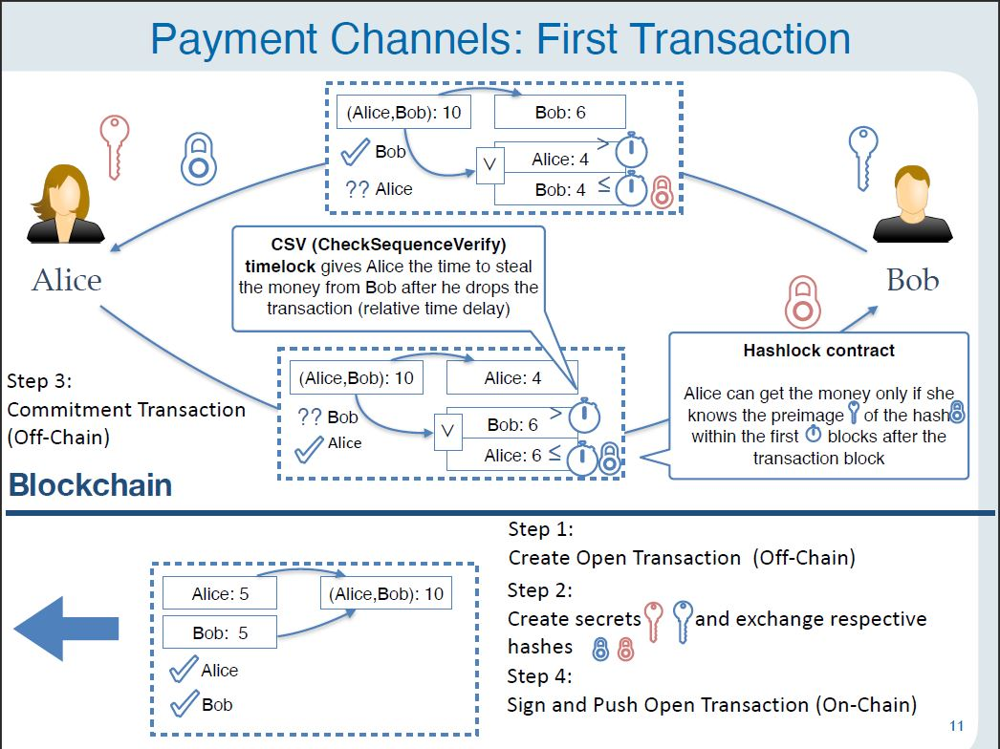

## State Change

## PCN

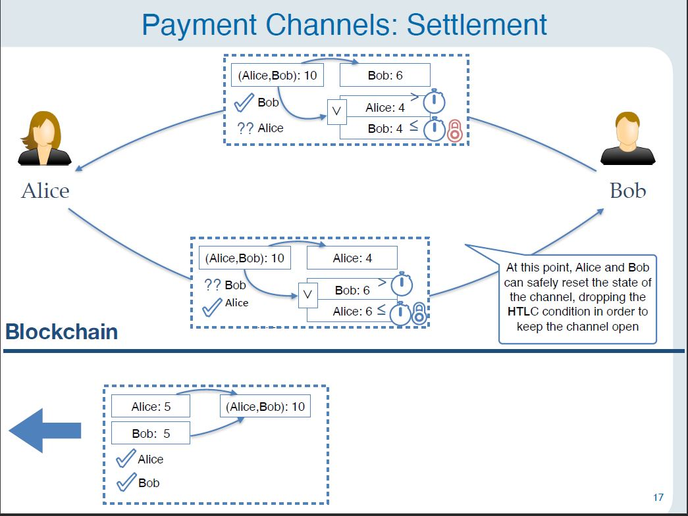

## Wormhole

## Privacy

## Fulgor
First Alice distrbutes keys (and ZKPs) to all parties.
Each intermediate party can open their lock when the party to the right has opened theirs.

## Recap

# Blitz
Try to do it in "one round".
## Attempt 1

## Attempt 2

## Attempt 3

## Pay or Revoke Paradigm

### Successful

### Refund
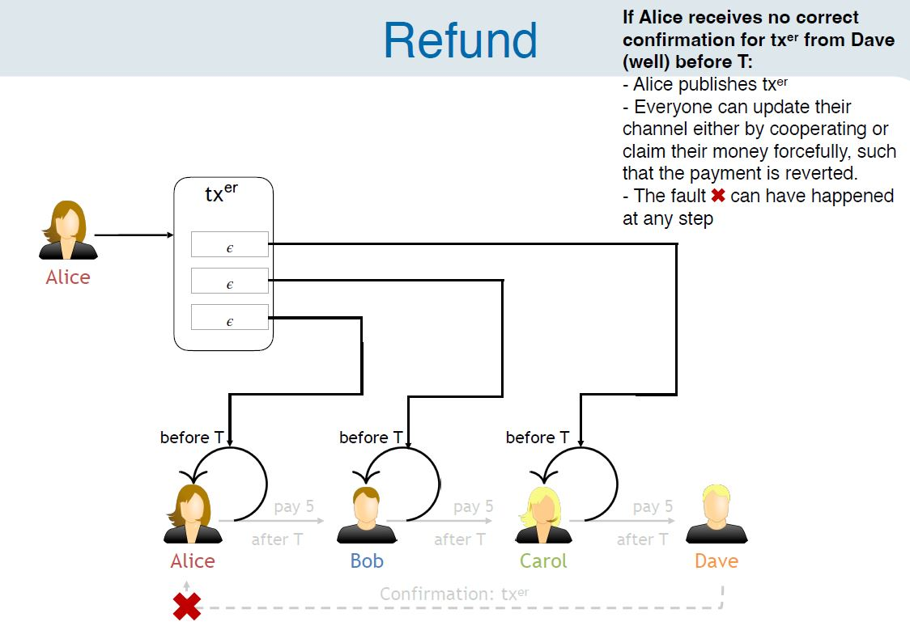

## Lightning vs. Blitz

# Thora

## Setup

## Success

## Revoke

## Take home

# Virtual Channels
## Idea

## Take home

# Payment Channel Hubs
## Idea

## Atomicity

## Unlinkability

## PCH with Fulgor

## Adaptor Signatures

## PCH with Adaptor Signatures
### First attempt
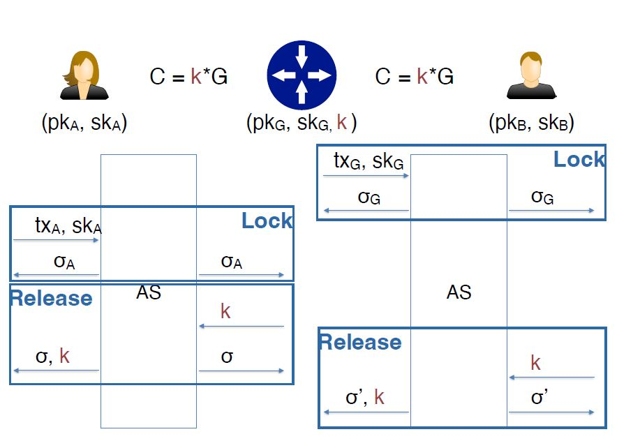

### Privacy Issue

### Privacy Solution

### Randomizable Puzzle
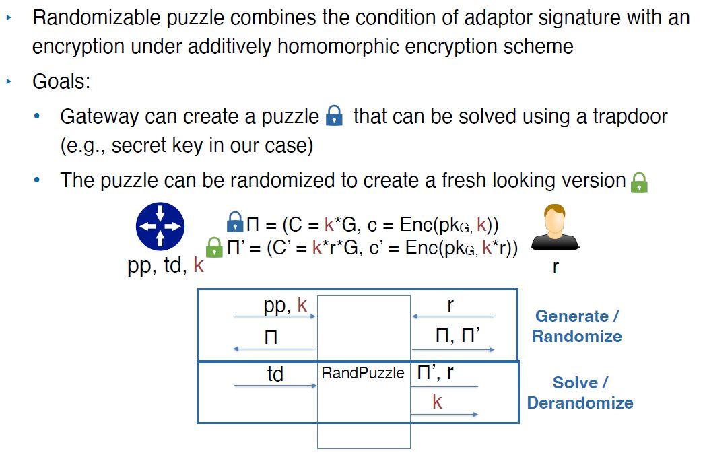

## A²L Protocol
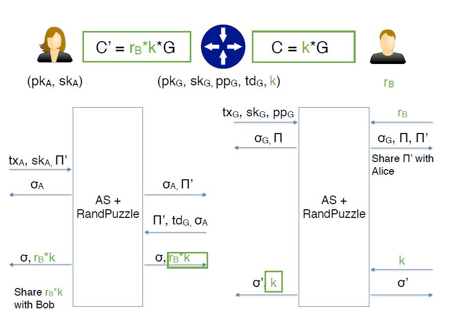

### Griefing Protection

### Take Home

# Scaling overview

## Idea

## Problem

## Solution (?)

# Watchtowers
## Problem: Incentive
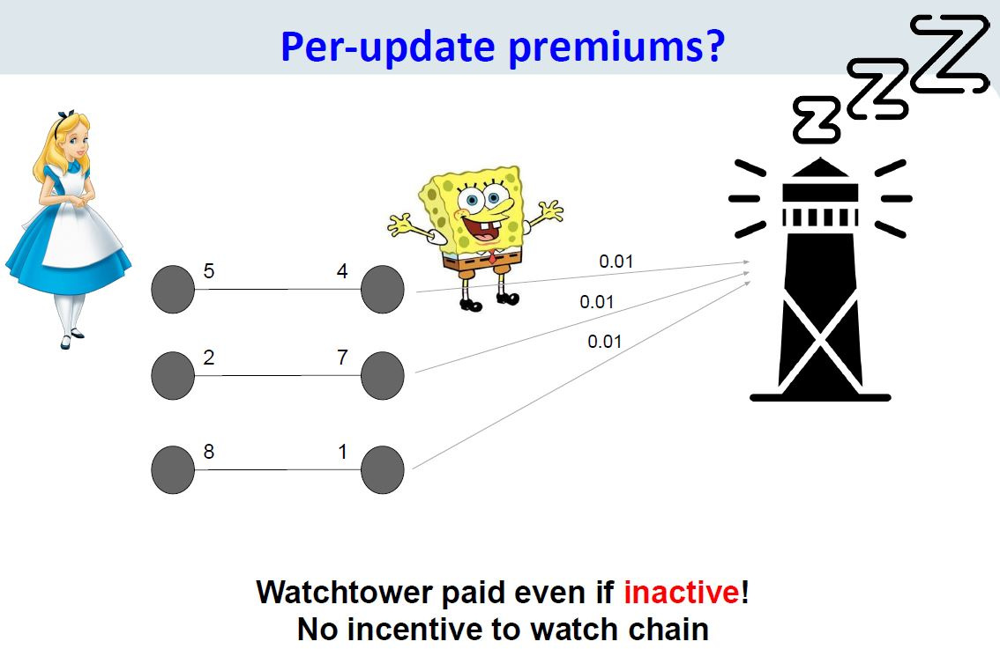

## Solution: Collateral

## Cerberus Channels

### Notation

Output (a+b) can either be spent by having the signature of A and waiting t or by having a multisig of A and B.

### Nonworking soltion (1/4)
Alice and WT can collude to scam bob.
Alice can spend output just after t. Bob would not be able to publish the penalty since the output is already spent.

### Nonworking soltion (2/4)
(Change to previous approach: Penalty depends on output controlled by bob instead of alice)

Alice and Bob can collude to scam WT.
Publish commitment + penalty right away.  WT has racecondition on the revocation.

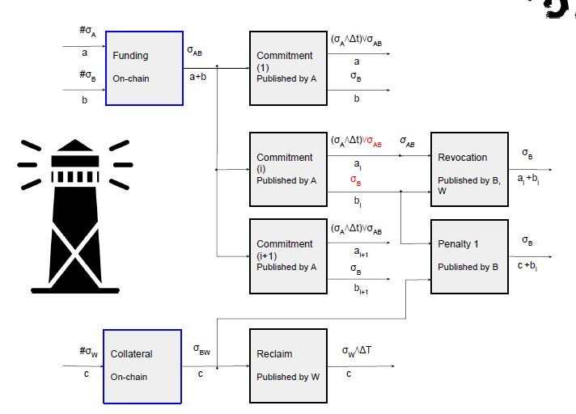

### Nonworking soltion (3/4)
(Change to previous approach: Add timelock to the input of the penalty)

Alice and bob can collude to scam WT.

Alice and bob agree to spend earlier output (not by revocation) making the revocation TX invalid.Then Bob can publish the penalty TX and WT cannot do anything about it.

### Nonworking soltion (4/4)
(Change to previous approach: Multisigs at outputs of commitment. Add timelock to bob's output -> cant send penalty right away (give WT time to react))

Alice and WT can collude to scam bob.

WT reclaims, Alice spends earlier tx.

### Working solution

# Watchtower Committee
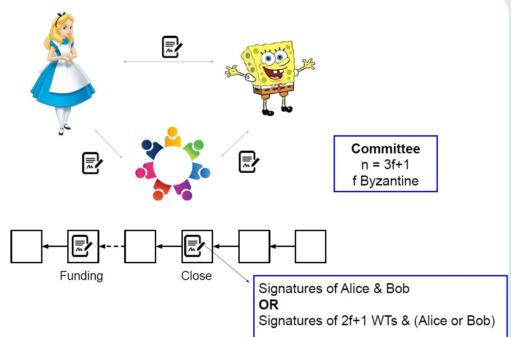

## Challanges

## Solution

## Incentives

Why assist to close honsetly?

### Collateral

### Why assist to close?

### Why request to close?

### Brick advantages

# Sharding
## Requirements

### Persistence

### Consistency

### Liveness

### Scalability

## The model
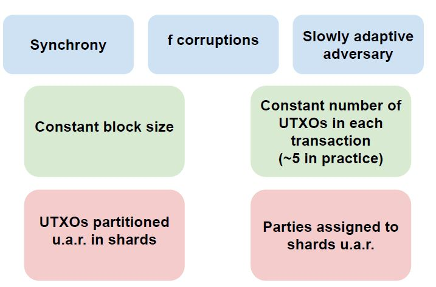

## Boundaries

## Roadmap

## The shardinc crux

## Evaluation
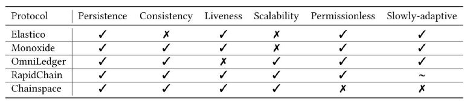

## Recap

# Rollups

## ZK-rollups

## Optimistic rollups

# Current research topics

